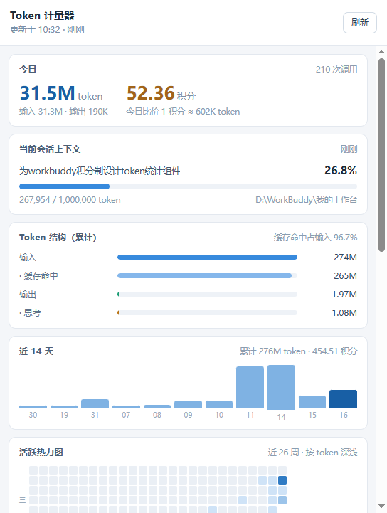
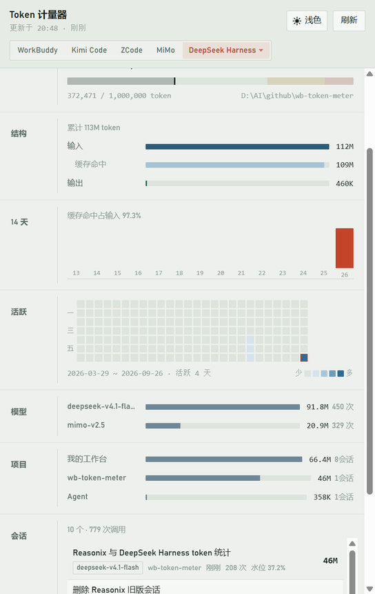
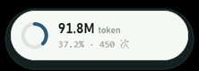

# Token 计量器

**一个本地用量面板，同时看得见 [WorkBuddy](https://www.workbuddy.cn/)、Kimi Code、ZCode 和 Xiaomi MiMo 的 token 消耗。**

WorkBuddy 采用积分制，界面上只显示积分、看不到 token 消耗。但每次模型调用的
官方 token 数据其实都写在本地磁盘上 —— 这个工具把它读出来，做成常驻托盘的用量面板。

Kimi Code、ZCode 与 Xiaomi MiMo 没有积分这一层，本地留的正好就是 token 用量本身。
面板右上角（或托盘菜单的「数据源」）可以随时切换看哪一个，几边的账本各算各的、互不影响。

> 非官方第三方工具，与 WorkBuddy、Kimi Code、ZCode、小米官方均无关。
> 所有数据都在本地读取和计算：不联网、不上传、不修改任何原始文件。

## 下载

到 [Releases](https://github.com/FightZhanAng/wb-token-meter/releases) 下载：

- `wb-token-meter-<版本>-setup.exe` —— 安装版，带开始菜单与桌面快捷方式
- `wb-token-meter-<版本>-portable.exe` —— 免安装版，双击即用



## 数据从哪来

**不需要估算，也不需要调接口。** 两边都把精确的 token 用量写在本地磁盘上，
只是没在界面上展示。

### WorkBuddy（带积分）

| 数据源 | 位置 | 内容 |
|---|---|---|
| 会话记录 | `~/.workbuddy/projects/<项目>/<会话id>.jsonl` | 每次模型调用的 `providerData.usage`：输入 / 输出 / 总量 / 缓存命中 / 思考 token，外加模型名与 traceId |
| 积分明细 | `~/.workbuddy/workbuddy.db` → `session_usage` | `credit_json` = `{traceId: 积分数}`；另有上下文水位 `used / size` |
| 会话元数据 | 同库 `sessions` 表 | 标题、模型、工作目录、状态 |

`providerData.traceId` 是串联三者的钥匙 —— 它同时出现在会话记录和积分明细里，
所以 token 消耗和积分扣费可以逐回合对上。

### Kimi Code（只有 token）

| 数据源 | 位置 | 内容 |
|---|---|---|
| 会话用量 | `~/.kimi-code/sessions/<工作区>/<会话id>/agents/<代理id>/wire.jsonl` | 每次模型请求的 `usage.record`：`inputOther` / `output` / `inputCacheRead` / `inputCacheCreation`，外加模型名与时间 |
| 上下文水位 | 同文件的 `token_counting.measured` | 当前上下文多少 token（相当于 WorkBuddy 的 `used`） |
| 会话元数据 | 同目录 `state.json` | 标题、工作目录、创建 / 更新时间、是否归档 |
| 上下文窗口 | `~/.kimi-code/config.toml` → `[models."<别名>"]` | `max_context_size`，用来算水位百分比 |

一行 `usage.record` 就是一次模型请求，四个 token 字段互不重叠：

```
输入 = inputOther + inputCacheRead + inputCacheCreation
缓存命中 = inputCacheRead
```

子代理（`agents/<id>`，`state.json` 里 `type=sub`）各写各的 `wire.jsonl`，
与 WorkBuddy 的处理一致：算真实消耗，但归到父会话名下。

### ZCode（只有 token）

| 数据源 | 位置 | 内容 |
|---|---|---|
| 用量明细 | `~/.zcode/cli/db/db.sqlite` → `model_usage` | **一次模型请求一行**：`input_tokens` / `output_tokens` / `reasoning_tokens` / `cache_read_input_tokens`，外加 `session_id`、`model_id`、`provider_id`、`started_at`、`duration_ms`、`tool_call_count`、`status` |
| 会话元数据 | 同库 `session` 表 | 标题、`directory`、`project_id`、创建 / 更新时间、是否归档 |
| 回合汇总 | 同库 `turn_usage` / `tool_usage` | 回合级的请求数、重试、工具错误、工具耗时 |

ZCode 是三个源里最好取的一份 —— 用量本身就是一张表，不用对账也不用逐行扫日志：

```
输入 = input_tokens（含缓存读）      缓存命中 = cache_read_input_tokens
输出 = output_tokens                思考   = reasoning_tokens（单列，界面照常显示）
```

两种特殊情况的处理：

- **上下文上限拿不到**。模型窗口写在 `~/.zcode/v2/config.json` 的
  `provider.<id>.models.<模型>.limit.context`，但远程 provider（本机用的
  `opencode-go-chat`）的模型目录不落本地，那里只有内置的 GLM / LongCat / mimo。
  所以水位只报「已用多少 token」，不给百分比。那个文件里有明文 apiKey，
  程序**不读它**。
- **历史从用量表建起来的那天开始**。更早的会话只存在于
  `~/.zcode/cli/rollout/model-io-*.jsonl`（每行一整次请求的完整 prompt + 响应，
  `response.usage` 里有同样的字段），本工具目前不解析它们。

两个只有 token 的数据源各扫各的目录、各用各的缓存，聚合共用
`src/shared/aggregate.ts`；WorkBuddy 那条链路完全独立 ——
切换数据源不会碰任何一边的数字。

### Xiaomi MiMo 桌面端（只有 token）

引擎是内嵌的 **mimocode**，数据根**不是** `~/.mimocode`（那只是插件工作区）：

| 数据源 | 位置 | 内容 |
|---|---|---|
| 用量明细 | `~/.local/share/mimocode/mimocode.db` → `message` 表 | 每条助手消息的 `data` JSON 里带 `tokens`：`input` / `output` / `reasoning` / `cache.read` / `cache.write`，外加 `modelID`、`providerID` |
| 会话元数据 | 同库 `session` 表 | 标题、`directory`、`project_id`、创建 / 更新 / 归档时间 |
| 上下文窗口 | `~/.cache/mimocode/models.json` | 引擎的模型目录（223 个 provider），每个模型带 `limit.context` |

**它的 token 口径和另外三个源反着来**，映射时要转一道：

```
total = input + output + reasoning + cache.read + cache.write
```

也就是说这里的 `input` 是**不含缓存读**的纯新增输入，而 WorkBuddy / Kimi Code /
ZCode 的 input 都含缓存。所以：

```
输入 = input + cache.read + cache.write      缓存命中 = cache.read
输出 = output                                思考 = reasoning（单列）
```

取 `message` 级而不是 `part` 级：`part` 表里 `step-finish` 那份 tokens 与 message
**完全同值**（是副本），而 message 级更全（本机实测 84 条 vs 72 条）。

不读 `cost`：引擎按价格表算的那个是**金额不是积分**，货币单位还随 provider 变，
界面上没有它的位置。


### 积分口径（仅 WorkBuddy）

积分以数据库记录为**权威口径**，不是用 token 反推的：

- `credits` —— 数据库里所有计费记录的总和
- `attributedCredits` —— 其中能对应到本地会话明细的部分
- `unattributedCredits` —— 只有计费记录、会话明细已被清理的部分

界面底部会把最后一项单独列出来，避免总额平白少一截。

Kimi Code 没有积分，这一整块（今日积分、比价、会话行的积分、未归因提示）
在切到 Kimi Code 时会整块收起，而不是显示成 0 分。

### 两点实测结论

- 累计输入 token 远大于「信息量」，因为每轮都要重发完整上下文。
  本机实测缓存命中占了输入的 ~96%，讨论用量时得看这一项。
- token 与积分**不是线性关系**（本机实测在 12 万 ~ 120 万 token/积分之间浮动），
  推测缓存命中和思考 token 的计价权重不同。界面上的比价是全局粗算，仅供参考。

## 运行

```bash
pnpm install
pnpm gen:icons     # 生成应用图标与 11 帧托盘进度环（纯 Node，无原生依赖）
pnpm dev           # 开发模式
pnpm typecheck
pnpm test:core     # 无头验证解析与聚合逻辑，不依赖 Electron
pnpm build         # 产物到 out/
pnpm dist          # 打包 Windows 安装包与免安装版到 release/
```

> 如果 `node_modules/electron/` 下缺 `dist/` 和 `path.txt`（pnpm 有时会静默跳过
> postinstall），从同机另一个 Electron 项目复制这两样即可，两边版本要一致 ——
> 本机的 43.3.0 二进制是从 `../water-reminder` 复制过来的。

### 环境变量

| 变量 | 用途 |
|---|---|
| `WB_TOKEN_METER_DIR` | 覆盖 WorkBuddy 数据目录，默认 `~/.workbuddy`（便于测试） |
| `WB_TOKEN_METER_KIMI_DIR` | 覆盖 Kimi Code 数据目录，默认 `~/.kimi-code` |
| `WB_TOKEN_METER_ZCODE_DIR` | 覆盖 ZCode 数据目录，默认 `~/.zcode` |
| `WB_TOKEN_METER_MIMO_DIR` | 覆盖 MiMo 数据目录，默认 `~/.local/share/mimocode` |
| `WB_TOKEN_METER_MIMO_CACHE_DIR` | 覆盖 MiMo 缓存目录（模型目录在里面），默认 `~/.cache/mimocode` |
| `WB_TOKEN_METER_SMOKE=1` | 冒烟自检：把启动状态写到 `%TEMP%\wbtm-smoke\` |
| `WB_TOKEN_METER_SMOKE_EXIT=1` | 自检报告写完后自动退出 |

启动后**不会弹主窗口** —— 看右下角的托盘图标：单击打开面板，右键出菜单，
菜单里能控制桌面胶囊与数据源。关窗只是隐藏，要退出得点菜单里的「退出」。

## 发布

推一个 `v*` 标签，GitHub Actions 会自动打包并创建 Release：

```bash
git tag -a v0.4.0 -m "v0.4.0"
git push origin v0.4.0
```

也可以在仓库的 Actions 页面手动触发 —— 手动跑只把安装包留档成 artifact，不发 Release。

CI 用 GitHub 官方下载源；本地 `pnpm dist` 默认走 npmmirror（这台机器直连
GitHub Downloads 会卡在证书吊销检查上）。两边都靠 `ELECTRON_MIRROR` 环境变量切换，
`scripts/dist.mjs` 只在未设置时才补默认值。

## 界面

右上角是**数据源切换**：`WorkBuddy` / `Kimi Code` / `ZCode` / `MiMo`，选择存在设置文件里，重启后还在。

- **今日** —— token 与积分，以及今日的 token/积分比价；没有积分的三个源把第二个大数字换成缓存命中率
- **当前会话上下文** —— 上下文水位进度条，超过 70% 转琥珀、90% 转红；模型上限未知时只报已用量
- **Token 结构** —— 输入 / 缓存命中 / 输出 / 思考 的分布（Kimi Code 不单列思考，其余三个单列）
- **近 14 天** —— 每日 token 柱状图（悬停看当日积分）
- **活跃热力图** —— 近 26 周，GitHub 贡献图那种格子；越深表示当天 token 越多
- **按模型 / 按项目** —— 用量排行
- **会话排行** —— 每个会话的 token、积分、调用次数、上下文水位



托盘图标是一圈进度环，表示当前活跃会话的上下文水位，颜色随水位变化；
悬停显示今日 token（WorkBuddy 下还有积分）；右键菜单可以切换数据源、刷新、
控制桌面胶囊、打开数据目录、退出。

关窗即隐藏到托盘，只有菜单里的「退出」才会真正结束进程。

## 桌面胶囊

常驻桌面的小胶囊，显示今日 token、上下文水位环与积分（Kimi Code 下换成今日调用次数）。
拖动移动并自动记住位置，单击打开主面板。



**在胶囊上右键、在托盘图标上右键，弹出来的是同一份菜单。**

| 菜单项 | 能改什么 |
|---|---|
| 数据源 | WorkBuddy / Kimi Code / ZCode / MiMo |
| 桌面胶囊 | 显示 / 隐藏 |
| 胶囊尺寸 | 小 / 中 / 大（胶囊本体 152×44、198×56、252×68） |
| 胶囊不透明度 | 100% ~ 50% |
| 胶囊始终置顶 | 是否压在其它窗口之上 |
| 复位胶囊位置 | 丢回主屏右下角 |
| 胶囊实心底色 | 关掉透明，改用白色矩形窗口（见下方取舍） |

设置存在 `%APPDATA%/wb-token-meter/wb-token-meter.json`（开发态则在 Electron 的默认 userData 下）。

**四个刻意的取舍**：

- 窗口比胶囊大 12px（`SHADOW_PAD`）。这圈留白不是装饰：`box-shadow` 画在元素
  外侧，窗口若和胶囊一样大，阴影会被窗口边界切平、露出一条直边，看起来就像
  胶囊外面糊了一层底色。所以阴影的 `|offset-y| + blur` 必须小于这个留白
  —— 别随手把 blur 调到 20px 以上。
- 胶囊默认是**半透明圆角**。透明窗口在部分 Windows 环境（显示缩放非 100%、
  特定显卡驱动）会「窗口存在但屏幕上看不见」，所以留了**实心底色**当降级开关。
  切换它会重建窗口 —— `transparent` 是创建参数，运行期改不了。
- 单击与拖动**共用一套指针事件**，位移超过 3px 才算拖动。用 CSS 的
  `-webkit-app-region: drag` 拖动更顺，但它会把 click 事件整个吃掉，
  就没法「点击打开面板」了。
- 胶囊最大档也只有 252×68。透明窗口不做逐像素命中测试，整块矩形都会挡住
  下面窗口的点击，做大了很烦人。

## 已知限制

- 少数计费回合（本机实测约 4/47）找不到对应的会话明细，通常是会话已被清理 —— 界面会提示这部分「未归因」积分。
- WorkBuddy 里带子代理的会话会在会话排行里占两行（主会话与子代理各一条，共用同一个 sessionId），
  「N 个会话」也因此比实际会话数偏大。两行的 token 不重复计，只是没有合并成一行。
- 会话记录是 JSONL，体量可能到几 MB。首次扫描本机 25 个会话约 0.6 秒，之后靠文件 mtime 缓存增量跳过。
- `workbuddy.db` 带 `-wal` / `-shm`，且可能被运行中的 WorkBuddy 持有。程序先尝试只读直开，失败就把三件套复制到临时目录再读。
- Kimi Code 的上下文水位按「会话最后一次用的模型」的 `max_context_size` 算；
  模型不在 `config.toml` 里（例如内置模型）时窗口未知，水位只报已用量、不给百分比。
- ZCode 的上下文上限本机拿不到（远程 provider 的模型目录不落本地），
  所以它的水位只显示「已用多少 token」，没有百分比和进度条。
- ZCode 的用量表只覆盖它开始记录之后的请求；更早的会话只留在
  `~/.zcode/cli/rollout/` 的 `model-io-*.jsonl` 里，本工具不解析。
- ZCode 的子代理会话（`session.task_type='subagent_child'`）若有用量，
  会作为独立会话出现在排行里，不像 Kimi Code 那样并入父会话。
- MiMo 的上下文窗口来自引擎自己的模型目录 `~/.cache/mimocode/models.json`；
  文件缺失、或模型不在目录里（自建 provider 的私有模型）时，水位只报已用量、不给百分比。
- MiMo 的用量只覆盖 `message` 表里记着 tokens 的那些请求；
  引擎按价格表算的 `cost` 是金额不是积分，本工具不读它。

## 许可

MIT
