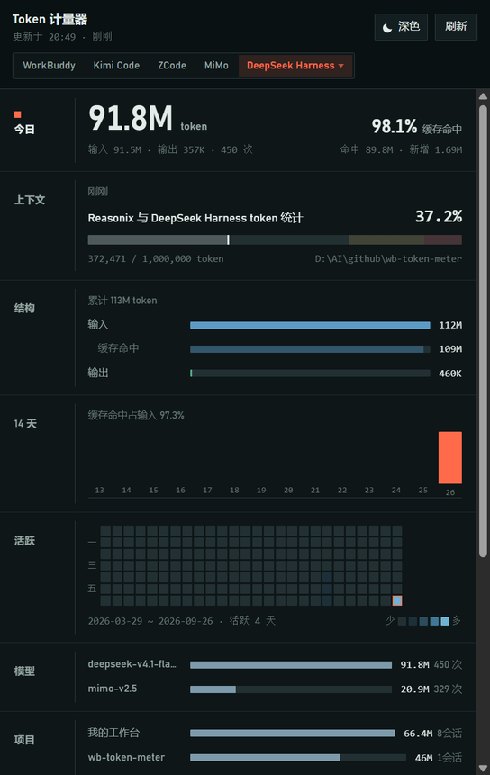

# Token 计量器

**一个用量面板，同时看得见 [WorkBuddy](https://www.workbuddy.cn/)、Kimi Code、ZCode、
Xiaomi MiMo、Reasonix、DeepSeek Harness 与 OpenCode Go 的消耗。**

WorkBuddy 采用积分制，界面上只显示积分、看不到 token 消耗。但每次模型调用的
官方 token 数据其实都写在本地磁盘上 —— 这个工具把它读出来，做成常驻托盘的用量面板。

Kimi Code、ZCode、Xiaomi MiMo、Reasonix 与 DeepSeek Harness 没有积分这一层，
本地留的正好就是 token 用量本身。
OpenCode Go 更特别：它连 token 都不给看，只有订阅额度的占用比例，得联网去问。
面板右上角（或托盘菜单的「数据源」）可以随时切换看哪一个，几边的账本各算各的、互不影响。

> 非官方第三方工具，与 WorkBuddy、Kimi Code、ZCode、小米、Reasonix、
> DeepSeek、opencode 官方均无关。
> 除 OpenCode Go 的额度查询外，所有数据都在本地读取和计算，不修改任何原始文件。
> 唯一的出站请求是 `GET https://opencode.ai/zen/go/v1/usage`（带本机凭证读来的 key），
> 只为了拿那三个百分比 —— 不发送任何本地数据。

## 下载

到 [Releases](https://github.com/FightZhanAng/wb-token-meter/releases) 下载：

- `wb-token-meter-<版本>-setup.exe` —— 安装版，带开始菜单与桌面快捷方式
- `wb-token-meter-<版本>-portable.exe` —— 免安装版，双击即用


## 数据从哪来

**不需要估算。** 六个源把精确的 token 用量写在本地磁盘上，只是没在界面上展示；
OpenCode Go 的额度比例则来自它的在线接口。

### WorkBuddy（带积分）

| 数据源 | 位置 | 内容 |
|---|---|---|
| 会话记录 | `~/.workbuddy/projects/<项目>/<会话id>.jsonl` | 每次模型调用的 `providerData.usage`：输入 / 输出 / 总量 / 缓存命中 / 思考 token，外加模型名与 traceId |
| 积分明细 | `~/.workbuddy/workbuddy.db` → `session_usage` | `credit_json` = `{traceId: 积分数}`；另有上下文水位 `used / size` |
| 会话元数据 | 同库 `sessions` 表 | 标题、模型、工作目录、状态 |

`providerData.traceId` 是串联三者的钥匙 —— 它同时出现在会话记录和积分明细里，
所以 token 消耗和积分扣费可以逐回合对上。

### Kimi Code（只有 token）

| 数据源 | 位置 | 内容 |
|---|---|---|
| 会话用量 | `~/.kimi-code/sessions/<工作区>/<会话id>/agents/<代理id>/wire.jsonl` | 每次模型请求的 `usage.record`：`inputOther` / `output` / `inputCacheRead` / `inputCacheCreation`，外加模型名与时间 |
| 上下文水位 | 同文件的 `token_counting.measured` | 当前上下文多少 token（相当于 WorkBuddy 的 `used`） |
| 会话元数据 | 同目录 `state.json` | 标题、工作目录、创建 / 更新时间、是否归档 |
| 上下文窗口 | `~/.kimi-code/config.toml` → `[models."<别名>"]` | `max_context_size`，用来算水位百分比 |

一行 `usage.record` 就是一次模型请求，四个 token 字段互不重叠：

```
输入 = inputOther + inputCacheRead + inputCacheCreation
缓存命中 = inputCacheRead
```

子代理（`agents/<id>`，`state.json` 里 `type=sub`）各写各的 `wire.jsonl`，
与 WorkBuddy 的处理一致：算真实消耗，但归到父会话名下。

### ZCode（只有 token）

| 数据源 | 位置 | 内容 |
|---|---|---|
| 用量明细 | `~/.zcode/cli/db/db.sqlite` → `model_usage` | **一次模型请求一行**：`input_tokens` / `output_tokens` / `reasoning_tokens` / `cache_read_input_tokens`，外加 `session_id`、`model_id`、`provider_id`、`started_at`、`duration_ms`、`tool_call_count`、`status` |
| 会话元数据 | 同库 `session` 表 | 标题、`directory`、`project_id`、创建 / 更新时间、是否归档 |
| 回合汇总 | 同库 `turn_usage` / `tool_usage` | 回合级的请求数、重试、工具错误、工具耗时 |

ZCode 是三个源里最好取的一份 —— 用量本身就是一张表，不用对账也不用逐行扫日志：

```
输入 = input_tokens（含缓存读）      缓存命中 = cache_read_input_tokens
输出 = output_tokens                思考   = reasoning_tokens（单列，界面照常显示）
```

两种特殊情况的处理：

- **上下文上限拿不到**。模型窗口写在 `~/.zcode/v2/config.json` 的
  `provider.<id>.models.<模型>.limit.context`，但远程 provider（本机用的
  `opencode-go-chat`）的模型目录不落本地，那里只有内置的 GLM / LongCat / mimo。
  所以水位只报「已用多少 token」，不给百分比。那个文件里有明文 apiKey，
  程序**不读它**。
- **历史从用量表建起来的那天开始**。更早的会话只存在于
  `~/.zcode/cli/rollout/model-io-*.jsonl`（每行一整次请求的完整 prompt + 响应，
  `response.usage` 里有同样的字段），本工具目前不解析它们。

只有 token 的那几个源各扫各的目录、各用各的缓存，聚合共用
`src/shared/aggregate.ts`；WorkBuddy 那条链路完全独立 ——
切换数据源不会碰任何一边的数字。

### Xiaomi MiMo 桌面端（只有 token）

引擎是内嵌的 **mimocode**，数据根**不是** `~/.mimocode`（那只是插件工作区）：

| 数据源 | 位置 | 内容 |
|---|---|---|
| 用量明细 | `~/.local/share/mimocode/mimocode.db` → `message` 表 | 每条助手消息的 `data` JSON 里带 `tokens`：`input` / `output` / `reasoning` / `cache.read` / `cache.write`，外加 `modelID`、`providerID` |
| 会话元数据 | 同库 `session` 表 | 标题、`directory`、`project_id`、创建 / 更新 / 归档时间 |
| 上下文窗口 | `~/.cache/mimocode/models.json` | 引擎的模型目录（223 个 provider），每个模型带 `limit.context` |

**它的 token 口径和另外几个源反着来**，映射时要转一道：

```
total = input + output + reasoning + cache.read + cache.write
```

也就是说这里的 `input` 是**不含缓存读**的纯新增输入，而 WorkBuddy / Kimi Code /
ZCode / Reasonix 的 input 都含缓存。所以：

```
输入 = input + cache.read + cache.write      缓存命中 = cache.read
输出 = output                                思考 = reasoning（单列）
```

取 `message` 级而不是 `part` 级：`part` 表里 `step-finish` 那份 tokens 与 message
**完全同值**（是副本），而 message 级更全（本机实测 84 条 vs 72 条）。

不读 `cost`：引擎按价格表算的那个是**金额不是积分**，货币单位还随 provider 变，
界面上没有它的位置。

### Reasonix（只有 token）

桌面端与 CLI 共用一套引擎，每次模型调用往同一本流水账上追加一行 ——
五个本地源里最直白的一份：

| 数据源 | 位置 | 内容 |
|---|---|---|
| 用量流水 | `~/.reasonix/usage.jsonl` | 一次调用一行：`promptTokens` / `completionTokens` / `cacheHitTokens` / `cacheMissTokens`，外加 `ts`、`session`、`model` |
| 会话元数据 | `~/.reasonix/sessions/<会话名>.meta.json` | `summary`（标题）、`workspace`（工作目录）、`lastPromptTokens`（当前上下文） |

口径（实测 `promptTokens === cacheHitTokens + cacheMissTokens` 在 1799 行上无例外）：

```
输入 = promptTokens（含缓存读）      缓存命中 = cacheHitTokens
输出 = completionTokens              思考 = 无（引擎把它算进 output 了）
```

`kind: "subagent"` 的行是子代理的调用，算真实消耗但不单列会话 —— 流水账里
`session` 字段写的还是原会话名，所以自然并进去了。

本模块**刻意不读 `~/.reasonix/config.json`**：那里面存着明文 apiKey，而这里需要的
标题 / 工作目录 / 上下文水位在 `meta.json` 里都有。

### DeepSeek Harness 桌面端（只有 token）

数据根是 `~/.dsh`。会话的事件流落成**多帧 zstd**，文件名带格式世代：

| 数据源 | 位置 | 内容 |
|---|---|---|
| 会话日志 | `~/.dsh/sessions/<工作目录转义名>/<会话id>/session[.vN].jsonl.zstd` | `assistant/message` 的 `data.usage`：`inputTokens` / `outputTokens` / `cacheReadTokens` / `cacheWriteTokens`；另有 `session`（id / cwd / 创建时间）、`session/title`、`request/header`、`model/selection`、`request/context`（模型窗口） |
| 归档标记 | `~/.dsh/storages/workspace.json` → `archivedSessionIds` | 只用来把归档会话排除出「当前活跃会话」的评选 |

三个坑，都踩过了：

- **文件名的版本号是「格式世代」，不是副本**。同一代里只写一个文件，换格式时另起
  一个名字接着写（本机实测 `session.jsonl.zstd` / `.v3` / `.v4` 三代并存），
  所以每个会话目录**只认版本号最高的那个**，全读会把同一段用量算好几遍。
- **Node 的 zstd 解压只吃第一帧**，而 DSH 是每 flush 一次追加一帧（本机最大的会话
  文件有 9411 帧）。所以要按魔数切帧、逐帧解，尾部写到一半的半帧停在上一帧。
- **用量只认 `assistant/message`**。更早的格式还会把同一次用量另发一遍
  `assistant/chunk`（`chunk.type === "usage"`），两份**完全同值** —— 一起算就是双倍。

口径（拿 DSH 自己的投影缓存 `storages/session_projcache/sessions/<id>.json`
逐会话对过账，非活跃会话全部逐字节相等）：

```
输入 = inputTokens + cacheReadTokens + cacheWriteTokens
缓存命中 = cacheReadTokens        输出 = outputTokens
```

也就是说它的 `inputTokens` 是**不含缓存读**的纯新增输入（投影缓存里那个字段就叫
`uncachedInputTokens`），跟 MiMo 一样反着来。思考 token 没有：pi-ai 把 reasoning
折进 output 了，界面上「· 思考」整行收起。


### OpenCode Go（只有额度，联网查询）

**它是唯一一个不读本地文件的源** —— 用量不在磁盘上，得去问接口：

| 数据源 | 位置 | 内容 |
|---|---|---|
| 额度占用 | `https://opencode.ai/zen/go/v1/usage`（GET，`Authorization: Bearer <key>`） | `usage.rolling` / `usage.weekly` / `usage.monthly` 三个窗口，各带 `percent`（0-100 的整数）与 `resetsAt` |
| 凭证 | `~/.local/share/opencode/auth.json` → `opencode-go.key` | 只读，不复制、不落盘、不进日志；每次请求前重读，重新连接后立刻生效 |

Go 是 $10/月的订阅，限额按**美元金额**算（5 小时 = 月限额的 20%、周 = 50%、月 = 100%），
而接口只回**已用比例**，所以这个源：

- 没有 token、没有会话、没有模型明细 —— 界面走的是「额度水位 / 数据来源 / 额度消耗趋势」三张卡
- 拿不到剩余金额，也无法拆到单个模型（服务端已经折算成一个百分比）
- **趋势曲线是本地记的**：每次成功拉取时往设置目录下的 `opencode-usage-history.jsonl`
  记一条采样（值没变也每半小时留一条心跳，保留 30 天），接口本身不提供历史

请求节流：自动刷新最小间隔 60 秒（轮询本身是 20 秒一次），失败按 60s → 120s → 300s
退避；托盘与面板上的手动刷新会强制绕过节流。整块逻辑在 `src/main/opencode-usage.ts`，
与另外六个源完全隔离 —— 网络失败不影响它们的统计。


### 积分口径（仅 WorkBuddy）

积分以数据库记录为**权威口径**，不是用 token 反推的：

- `credits` —— 数据库里所有计费记录的总和
- `attributedCredits` —— 其中能对应到本地会话明细的部分
- `unattributedCredits` —— 只有计费记录、会话明细已被清理的部分

界面底部会把最后一项单独列出来，避免总额平白少一截。

Kimi Code 没有积分，这一整块（今日积分、比价、会话行的积分、未归因提示）
在切到它时会整块收起，而不是显示成 0 分。

### 两点实测结论

- 累计输入 token 远大于「信息量」，因为每轮都要重发完整上下文。
  本机实测缓存命中占了输入的 ~96%，讨论用量时得看这一项。
- token 与积分**不是线性关系**（本机实测在 12 万 ~ 120 万 token/积分之间浮动），
  推测缓存命中和思考 token 的计价权重不同。界面上的比价是全局粗算，仅供参考。

## 运行

```bash
pnpm install
pnpm gen:icons     # 生成应用图标与 11 帧托盘进度环（纯 Node，无原生依赖）
pnpm dev           # 开发模式
pnpm typecheck
pnpm test:core     # 无头验证解析与聚合逻辑，不依赖 Electron（跑本机的真实数据）
pnpm test:ci       # 同上，但把家目录指到空目录 —— 复现 CI 的条件
pnpm build         # 产物到 out/
pnpm dist          # 打包 Windows 安装包与免安装版到 release/
```

> **`test:core` 与 `test:ci` 都要跑。** 带真实数据的断言只在数据目录存在时才执行，
> 所以本机有 `~/.workbuddy`、`~/.dsh` 这些目录时，一部分代码路径在 `test:core` 里
> 根本走不到 —— `test:ci` 把家目录指到空目录、清掉所有 `WB_TOKEN_METER_*` 覆盖变量，
> 走的就是 CI 那条路。v0.6.0 第一次打标签挂在这儿：两条断言顺手写成了「缓存非空」，
> 本机永远是绿的，CI 上目录不存在，必然判死。

> 如果 `node_modules/electron/` 下缺 `dist/` 和 `path.txt`（pnpm 有时会静默跳过
> postinstall），从同机另一个 Electron 项目复制这两样即可，两边版本要一致 ——
> 本机的 43.3.0 二进制是从 `../water-reminder` 复制过来的。

### 环境变量

| 变量 | 用途 |
|---|---|
| `WB_TOKEN_METER_DIR` | 覆盖 WorkBuddy 数据目录，默认 `~/.workbuddy`（便于测试） |
| `WB_TOKEN_METER_KIMI_DIR` | 覆盖 Kimi Code 数据目录，默认 `~/.kimi-code` |
| `WB_TOKEN_METER_ZCODE_DIR` | 覆盖 ZCode 数据目录，默认 `~/.zcode` |
| `WB_TOKEN_METER_MIMO_DIR` | 覆盖 MiMo 数据目录，默认 `~/.local/share/mimocode` |
| `WB_TOKEN_METER_MIMO_CACHE_DIR` | 覆盖 MiMo 缓存目录（模型目录在里面），默认 `~/.cache/mimocode` |
| `WB_TOKEN_METER_REASONIX_DIR` | 覆盖 Reasonix 数据目录（`usage.jsonl` 在里面），默认 `~/.reasonix` |
| `WB_TOKEN_METER_DSH_DIR` | 覆盖 DeepSeek Harness 数据目录（会话日志在里面），默认 `~/.dsh` |
| `WB_TOKEN_METER_OPENCODE_DIR` | 覆盖 OpenCode 数据目录（`auth.json` 在里面），默认 `~/.local/share/opencode` |
| `WB_TOKEN_METER_OPENCODE_URL` | 覆盖额度查询端点（测试用），默认官方地址 |
| `WB_TOKEN_METER_OPENCODE_KEY` | 直接指定额度查询用的 key（测试用），给了就不读 `auth.json` |
| `WB_TOKEN_METER_SMOKE=1` | 冒烟自检：把启动状态写到 `%TEMP%\wbtm-smoke\` |
| `WB_TOKEN_METER_SMOKE_EXIT=1` | 自检报告写完后自动退出 |

启动后**不会弹主窗口** —— 看右下角的托盘图标：单击打开面板，右键出菜单，
菜单里能控制桌面胶囊与数据源。关窗只是隐藏，要退出得点菜单里的「退出」。

## 发布

推一个 `v*` 标签，GitHub Actions 会自动打包并创建 Release：

```bash
git tag -a v0.6.0 -m "v0.6.0"
git push origin v0.6.0
```

也可以在仓库的 Actions 页面手动触发 —— 手动跑只把安装包留档成 artifact，不发 Release。

CI 用 GitHub 官方下载源；本地 `pnpm dist` 默认走 npmmirror（这台机器直连
GitHub Downloads 会卡在证书吊销检查上）。两边都靠 `ELECTRON_MIRROR` 环境变量切换，
`scripts/dist.mjs` 只在未设置时才补默认值。

## 界面

### 一套记录仪的语法

这个工具是个**计量器**，界面就照多通道记录仪来画：整块面板是一张记录纸，
每张卡是纸上的一个**通道** —— 左边一条窄栏写通道名，一条竖细线（脊）从上贯到下，
数据占右边一栏。没有卡片、没有阴影、没有统一的圆角，结构全靠格线和分区表达。

三件刻意的取舍：

- **只有被测量的东西才有颜色。** 外壳一律是纸 + 墨 + 细线；颜色只出现在数据上。
  「记录笔红」只表示一个意思：**现在** —— 今日那个通道、今天那根柱子、
  当前数据源、热力图里今天那一格。
- **上下文水位是一把带红线区的仪表。** 70% / 90% 两条分界**印在刻度槽上**，
  永远看得见；指针落在哪个区就染哪个区的颜色。这样「红」说的是「进红线区了」，
  而不是「我把整条进度条刷红了」。
- **纸上没有背景网格。** 格线只在热力图里出现，因为那里格子本身就是数据；
  铺满整页的网格会和热力图打架，纯粹是噪声。

字体两把：**Bahnschrift**（DIN 血统，Win10+ 自带）做界面字，
大号读数也用它 —— Consolas 的 `0` 带一道斜杠，38px 下就是个刺眼的「Ø」；
**Consolas** 只用在需要成列对齐的小数字上（表格值、刻度、脚注）。

> 机头分两行：第一行是标题 + 更新时间，右边是**外观循环按钮**
> （系统 → 浅色 → 深色，点一下就换）与刷新；第二行整行给**数据源切换**。
> 数据源是这一页的主导航，挤在标题旁边只会把标题压成「Token ...」——
> 现在横向摆得下四个（`WorkBuddy` / `Kimi Code` / `ZCode` / `MiMo`），
> 其余三个收在「更多」里；当前源落在「更多」里时，那个按钮会显示它的名字。
> 数据源与外观都存进设置文件，重启后还在。

### 深色主题

浅色是**记录纸**（冷调浅灰绿，刻意避开「米色 + 衬线 + 陶土红」那套），
深色是**暗房里的同一台仪器**（深青灰机壳，不是纯黑；记录笔提亮到在深底上仍然抓眼）。
两套共用同一份结构，只有 CSS 令牌不同。

外观有三档：**跟随系统 / 浅色 / 深色**。

- 面板顶栏那个按钮点一下循环切一档，鼠标悬停会说明当前是哪一档；
- 托盘菜单里是完整的三选一（`外观：跟随系统`）；
- 实现走 Electron 的 `nativeTheme.themeSource`：主进程设一次，
  两个窗口的 `prefers-color-scheme` 就跟着变，CSS 直接生效 ——
  不用再自己发一套主题消息，也就没有「主进程和页面各记一份」的机会。
  `data-theme` 属性由 HTML 里的内联脚本在样式表**之前**写好，
  所以深色下不会先闪一帧浅色。



### 面板上的通道

- **今日** —— token 与积分（没有积分的六个源把第二个大数字换成缓存命中率），
  下面一行是输入 / 输出 / 调用次数
- **上下文** —— 带红线区的仪表：已用量、指针、以及会话的工作目录；
  模型上限未知时只报已用量
- **结构** —— 输入 / 缓存命中 / 输出 / 思考 的分布（WorkBuddy / ZCode / MiMo 单列思考，其余四个不单列）
- **14 天** —— 每日 token 柱状图，**补齐空档**：没有用量的日子画成 0 高度。
  只画「有数据的那些天」会让柱子等距排列，看起来是条连续时间轴，实际日期却在跳
- **活跃** —— 近 26 周，GitHub 贡献图那种格子；越深表示当天 token 越多，
  今天那一格带一圈记录笔色的边
- **模型 / 项目** —— 用量排行
- **会话** —— 每个会话的 token、积分、调用次数、上下文水位


**OpenCode Go 是另一套界面** —— 它没有 token 明细，上面这些通道会整块换成三个：
额度水位（5 小时 / 本周 / 本月三条带分区的刻度槽，各带重置时间）、数据来源（接口、凭证、
上次更新，以及取不到时的提示）、额度消耗趋势（本地采样的折线图）。

托盘图标是一圈进度环：六个本地源显示当前活跃会话的上下文水位，OpenCode Go 显示
5 小时额度的占用比例，颜色随水位变化；悬停显示今日 token（WorkBuddy 下还有积分）
或三个额度百分比；右键菜单可以切换数据源与外观、刷新、控制桌面胶囊、打开数据目录、退出。

关窗即隐藏到托盘，只有菜单里的「退出」才会真正结束进程。

## 桌面胶囊

常驻桌面的小胶囊，显示今日 token、上下文水位环与积分（没有积分的源换成今日调用次数）；
切到 OpenCode Go 时换成 5 小时额度环、百分比与重置时间。
拖动移动并自动记住位置，单击打开主面板。


**在胶囊上右键、在托盘图标上右键，弹出来的是同一份菜单。**

| 菜单项 | 能改什么 |
|---|---|
| 数据源 | WorkBuddy / Kimi Code / ZCode / MiMo / Reasonix / DeepSeek Harness / OpenCode Go |
| 外观 | 跟随系统 / 浅色 / 深色 |
| 桌面胶囊 | 显示 / 隐藏 |
| 胶囊尺寸 | 小 / 中 / 大（胶囊本体 152×44、198×56、252×68） |
| 胶囊不透明度 | 100% ~ 50% |
| 胶囊始终置顶 | 是否压在其它窗口之上 |
| 复位胶囊位置 | 丢回主屏右下角 |
| 胶囊实心底色 | 关掉透明，改用实底矩形窗口（见下方取舍） |

设置存在 `%APPDATA%/wb-token-meter/wb-token-meter.json`（开发态则在 Electron 的默认 userData 下）。

**四个刻意的取舍**：

- 窗口比胶囊大 12px（`SHADOW_PAD`）。这圈留白不是装饰：`box-shadow` 画在元素
  外侧，窗口若和胶囊一样大，阴影会被窗口边界切平、露出一条直边，看起来就像
  胶囊外面糊了一层底色。所以阴影的 `|offset-y| + blur` 必须小于这个留白
  —— 别随手把 blur 调到 20px 以上。
- 胶囊默认是**半透明圆角**。透明窗口在部分 Windows 环境（显示缩放非 100%、
  特定显卡驱动）会「窗口存在但屏幕上看不见」，所以留了**实心底色**当降级开关。
  切换它会重建窗口 —— `transparent` 是创建参数，运行期改不了。
- 单击与拖动**共用一套指针事件**，位移超过 3px 才算拖动。用 CSS 的
  `-webkit-app-region: drag` 拖动更顺，但它会把 click 事件整个吃掉，
  就没法「点击打开面板」了。
- 胶囊最大档也只有 252×68。透明窗口不做逐像素命中测试，整块矩形都会挡住
  下面窗口的点击，做大了很烦人。

## 已知限制

- 少数计费回合（本机实测约 4/47）找不到对应的会话明细，通常是会话已被清理 —— 界面会提示这部分「未归因」积分。
- WorkBuddy 里带子代理的会话会在会话排行里占两行（主会话与子代理各一条，共用同一个 sessionId），
  「N 个会话」也因此比实际会话数偏大。两行的 token 不重复计，只是没有合并成一行。
- 会话记录是 JSONL，体量可能到几 MB。首次扫描本机 25 个会话约 0.6 秒，之后靠文件 mtime 缓存增量跳过。
- `workbuddy.db` 带 `-wal` / `-shm`，且可能被运行中的 WorkBuddy 持有。程序先尝试只读直开，失败就把三件套复制到临时目录再读。
- Kimi Code 的上下文水位按「会话最后一次用的模型」的 `max_context_size` 算；
  模型不在 `config.toml` 里（例如内置模型）时窗口未知，水位只报已用量、不给百分比。
- ZCode 的上下文上限本机拿不到（远程 provider 的模型目录不落本地），
  所以它的水位只显示「已用多少 token」，没有百分比和进度条。
- ZCode 的用量表只覆盖它开始记录之后的请求；更早的会话只留在
  `~/.zcode/cli/rollout/` 的 `model-io-*.jsonl` 里，本工具不解析。
- ZCode 的子代理会话（`session.task_type='subagent_child'`）若有用量，
  会作为独立会话出现在排行里，不像 Kimi Code 那样并入父会话。
- MiMo 的上下文窗口来自引擎自己的模型目录 `~/.cache/mimocode/models.json`；
  文件缺失、或模型不在目录里（自建 provider 的私有模型）时，水位只报已用量、不给百分比。
- MiMo 的用量只覆盖 `message` 表里记着 tokens 的那些请求；
  引擎按价格表算的 `cost` 是金额不是积分，本工具不读它。
- Reasonix 的流水账只写当前活着的那个会话名：会话归档后（`sessions/<名>__archive_<时间>.jsonl`）
  历史行仍留在同一个名字下，所以归档会话的用量会并进原会话里，拆不开。
- Reasonix 拿不到上下文上限（引擎的模型目录不落本地），水位只报已用量、不给百分比。
- DeepSeek Harness 的子代理会话（`delegationDepth > 0`）是独立目录，算真实消耗但
  不并进父会话，会作为独立会话出现在排行里（与 ZCode 的 `subagent_child` 同样处理）。
- DeepSeek Harness 的会话日志是追加写的，正在跑的那个会话可能还没把最后一步 flush 下来，
  所以「今日」会滞后几十秒；首次全量扫描本机 15 个会话约 0.5 秒，之后靠 mtime 缓存跳过。
- OpenCode Go 的额度只有三个百分比：接口不回 token 数、不回剩余金额，也拆不到单个模型
  （官方文档里的 $15/$30/$60 是按模型的月限额，服务端已经折算成一个比例）。
- OpenCode Go 的趋势曲线是**本地采样**：应用没在跑时没有数据，断档期间的变化看不到。
- OpenCode Go 是唯一会发网络请求的源：断网或凭证失效时界面保留上一次成功的值并标注
  「旧数据」，同时按 60s → 120s → 300s 退避重试，不会反复打接口。

## 许可

MIT
