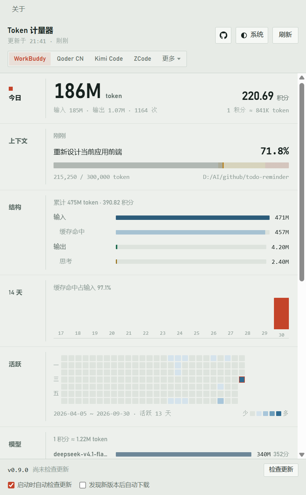
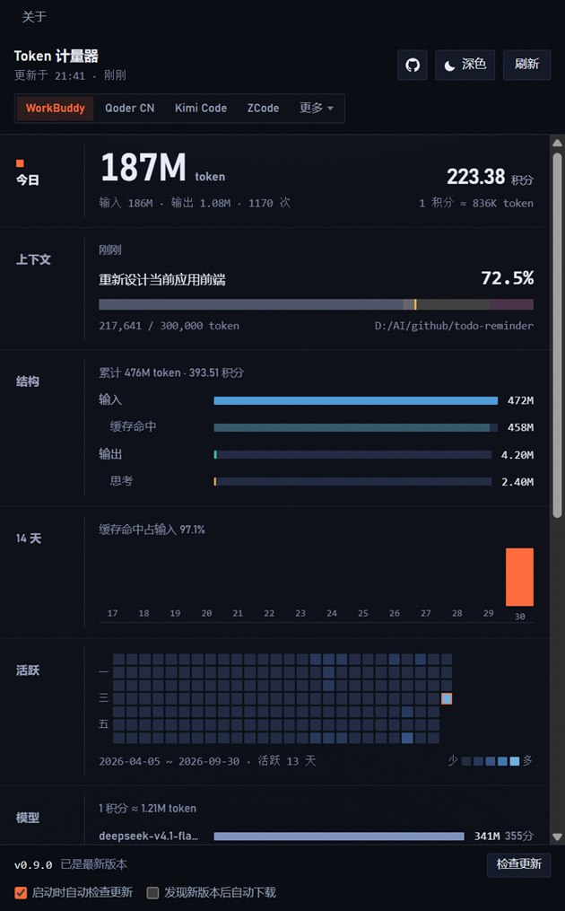
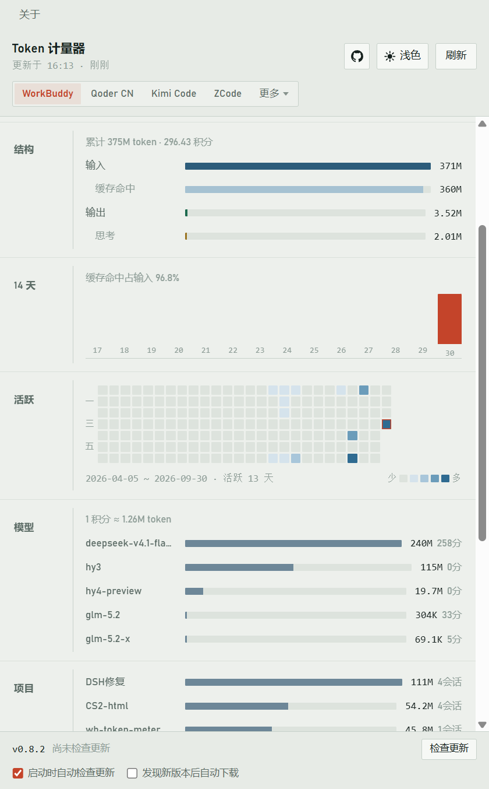
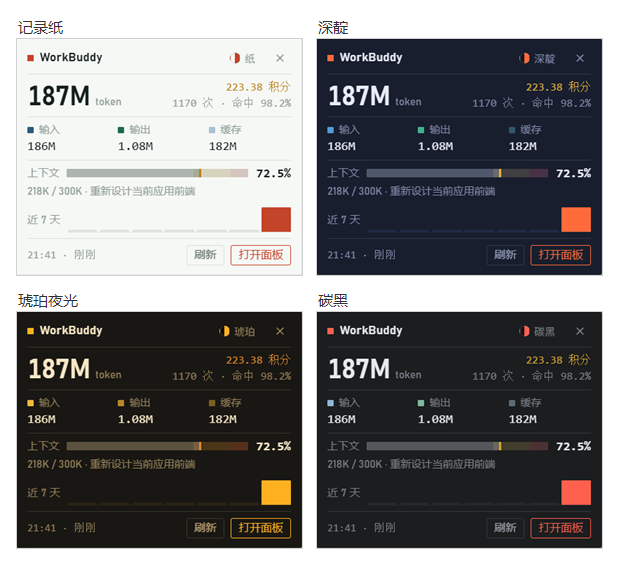

# Token 计量器

**一个用量面板，同时看得见 [WorkBuddy](https://www.workbuddy.cn/)、Qoder CN、Kimi Code、
ZCode、Xiaomi MiMo、Reasonix、DeepSeek Harness、TRAE SOLO CN、OpenCode 与 OpenCode Go 的消耗。**

WorkBuddy 采用积分制，界面上只显示积分、看不到 token 消耗。但每次模型调用的
官方 token 数据其实都写在本地磁盘上 —— 这个工具把它读出来，做成常驻托盘的用量面板。

Qoder CN 反过来：积分与上下文水位写在本地，token 一个都不给 ——
每次调用只留一笔积分，界面就按积分画。
Kimi Code、ZCode、Xiaomi MiMo、Reasonix、DeepSeek Harness 与 OpenCode 没有积分
这一层，本地留的正好就是 token 用量本身。TRAE SOLO CN 也是只有 token，
但它的账本加了密，还得先从运行中的进程里取到钥匙（见下）。
OpenCode Go 更特别：它连 token 都不给看，只有订阅额度的占用比例，得联网去问。
面板右上角（或托盘菜单的「数据源」）可以随时切换看哪一个，几边的账本各算各的、互不影响。

> 非官方第三方工具，与 WorkBuddy、Qoder、Kimi Code、ZCode、小米、Reasonix、
> DeepSeek、TRAE、opencode 官方均无关。
> 除 OpenCode Go 的额度查询和更新检查外，所有数据都在本地读取和计算，不修改任何原始文件。
> 出站请求只有两个：`GET https://opencode.ai/zen/go/v1/usage`（带本机凭证读来的 key，
> 拿那三个百分比）和更新检查（去本仓库的 Release 拉 `latest.yml`）—— 都不发送任何本地数据。

## 版本与更新

面板底部常驻一条**底轨**（在滚动区之外，始终看得见）：左边是当前版本号，
中间是更新状态，右边是动作按钮，下面两个开关。托盘菜单里也有版本号和同样的动作。

| 开关 | 默认 | 作用 |
|---|---|---|
| 启动时自动检查更新 | 开 | 启动后静默检查一次，之后每 24 小时一次。关掉就只能手动点「检查更新」 |
| 发现新版本后自动下载 | 关 | 打开后检测到新版本会后台下载，下完提示「重启并安装」；关掉只提示，自己去发布页下 |

安装版可以直接在应用内下载并安装（走 electron-updater 的差分下载）。
两种形态用不了自动更新，界面会**说明原因**而不是假装「已是最新」：
开发模式（没有更新配置）与免安装版（portable 没有一个能覆盖的安装目录）。
这两种情况下底轨只提供「打开发布页」。

## 下载

到 [Releases](https://github.com/FightZhanAng/wb-token-meter/releases) 下载：

- `wb-token-meter-<版本>-setup.exe` —— 安装版，带开始菜单与桌面快捷方式
- `wb-token-meter-<版本>-portable.exe` —— 免安装版，双击即用



## 数据从哪来

**不需要估算。** 九个源把精确的用量写在本地磁盘上，只是没在界面上展示 ——
其中 Qoder CN 能取到的只有积分与上下文水位（服务端不下发 token）；
OpenCode Go 的额度比例则来自它的在线接口。

### WorkBuddy（带积分）

| 数据源 | 位置 | 内容 |
|---|---|---|
| 会话记录 | `~/.workbuddy/projects/<项目>/<会话id>.jsonl` | 每次模型调用的 `providerData.usage`：输入 / 输出 / 总量 / 缓存命中 / 思考 token，外加模型名、traceId 与 conversationRequestId |
| 积分明细 | `~/.workbuddy/workbuddy.db` → `session_usage` | `credit_json` = `{计费键: 积分数}`；另有上下文水位 `used / size` |
| 会话元数据 | 同库 `sessions` 表 | 标题、模型、工作目录、状态 |

**计费键**以 `conversationRequestId` 为准（缺省时退回 `traceId`）—— 它同时出现在
会话记录和积分明细里，所以 token 消耗和积分扣费可以逐回合对上。
这是踩过坑的地方：2026-09 前后 WorkBuddy 把积分明细的 key 从 `traceId` 换成了
`conversationRequestId`，老版本两者同值、新版本分离；只认 traceId 会出现
「累计总额对、今日与新会话全 0」。实现见 `collector.ts` 的 `billingKey()`。

### Qoder CN（只有积分）

| 数据源 | 位置 | 内容 |
|---|---|---|
| 会话记录 | `~/.qoder-cn/projects/<项目转义名>/<会话id>.jsonl` | 每次模型请求一条 `message.usage`：`credits`（积分消耗）、`context_usage_ratio`（上下文水位 0~1）、`request_id`、`billable`，外加模型名与时间 |
| 会话标题 | 同上，文件里第一条真人输入 | `humanInput` 那段文本（多行会压成一行） |

**它的账本里没有 token** —— 输入 / 输出 / 缓存读 / 缓存写四个字段恒为 0，
客户端自己的上下文快照也标着 `tokenCountsAvailable: false`：Qoder CN 服务端
只回积分与水位比例。所以 token 通道（结构卡）整块收起，界面换成一套按积分画的：
今日积分、14 天积分柱、活跃热力图按积分深浅、模型 / 项目按积分排行，
上下文仪表直接按 `context_usage_ratio` 画（只报比例，不编 token 绝对值）。

两个坑，都踩过了：

- **分支（fork）会话会把父会话的历史整段复制进自己的 jsonl**。复制行带
  `forkedFrom`（原会话 id + 原行 uuid），行内 `sessionId` 则被改写成 fork 会话
  自己 —— 直接相加会把父会话的账重复算一遍（本机实测 154 次请求、约六成积分）。
  去重按 `usage.request_id` 全局进行，归属认 `forkedFrom.sessionId`。
- **`billable` 字段的语义未明**。本机 393 行里 false 占 379 行、且都带着非零
  credits，所以一律入账 —— 待与 Qoder 界面用量页对账后再定口径。

模型名是 `qfmodel` / `dfmodel` 这类内部别名，原样显示。采集只扫 jsonl、
不读凭证、不联网。

### Kimi Code（只有 token）

| 数据源 | 位置 | 内容 |
|---|---|---|
| 会话用量 | `~/.kimi-code/sessions/<工作区>/<会话id>/agents/<代理id>/wire.jsonl` | 每次模型请求的 `usage.record`：`inputOther` / `output` / `inputCacheRead` / `inputCacheCreation`，外加模型名与时间 |
| 上下文水位 | 同文件的 `token_counting.measured` | 当前上下文多少 token（相当于 WorkBuddy 的 `used`） |
| 会话元数据 | 同目录 `state.json` | 标题、工作目录、创建 / 更新时间、是否归档 |
| 上下文窗口 | `~/.kimi-code/config.toml` → `[models."<别名>"]` | `max_context_size`，用来算水位百分比 |

一行 `usage.record` 就是一次模型请求，四个 token 字段互不重叠：

```
输入 = inputOther + inputCacheRead + inputCacheCreation
缓存命中 = inputCacheRead
```

子代理（`agents/<id>`，`state.json` 里 `type=sub`）各写各的 `wire.jsonl`，
与 WorkBuddy 的处理一致：算真实消耗，但归到父会话名下。

### ZCode（只有 token）

| 数据源 | 位置 | 内容 |
|---|---|---|
| 用量明细 | `~/.zcode/cli/db/db.sqlite` → `model_usage` | **一次模型请求一行**：`input_tokens` / `output_tokens` / `reasoning_tokens` / `cache_read_input_tokens`，外加 `session_id`、`model_id`、`provider_id`、`started_at`、`duration_ms`、`tool_call_count`、`status` |
| 会话元数据 | 同库 `session` 表 | 标题、`directory`、`project_id`、创建 / 更新时间、是否归档 |
| 回合汇总 | 同库 `turn_usage` / `tool_usage` | 回合级的请求数、重试、工具错误、工具耗时 |

ZCode 是三个源里最好取的一份 —— 用量本身就是一张表，不用对账也不用逐行扫日志：

```
输入 = input_tokens（含缓存读）      缓存命中 = cache_read_input_tokens
输出 = output_tokens                思考   = reasoning_tokens（单列，界面照常显示）
```

两种特殊情况的处理：

- **上下文上限拿不到**。模型窗口写在 `~/.zcode/v2/config.json` 的
  `provider.<id>.models.<模型>.limit.context`，但远程 provider（本机用的
  `opencode-go-chat`）的模型目录不落本地，那里只有内置的 GLM / LongCat / mimo。
  所以水位只报「已用多少 token」，不给百分比。那个文件里有明文 apiKey，
  程序**不读它**。
- **历史从用量表建起来的那天开始**。更早的会话只存在于
  `~/.zcode/cli/rollout/model-io-*.jsonl`（每行一整次请求的完整 prompt + 响应，
  `response.usage` 里有同样的字段），本工具目前不解析它们。

只有 token 的那几个源各扫各的目录、各用各的缓存，聚合共用
`src/shared/aggregate.ts`（Qoder CN 也走这条 —— 积分随每次调用逐笔进聚合）；
WorkBuddy 那条链路完全独立 —— 切换数据源不会碰任何一边的数字。

### Xiaomi MiMo 桌面端（只有 token）

引擎是内嵌的 **mimocode**，数据根**不是** `~/.mimocode`（那只是插件工作区）：

| 数据源 | 位置 | 内容 |
|---|---|---|
| 用量明细 | `~/.local/share/mimocode/mimocode.db` → `message` 表 | 每条助手消息的 `data` JSON 里带 `tokens`：`input` / `output` / `reasoning` / `cache.read` / `cache.write`，外加 `modelID`、`providerID` |
| 会话元数据 | 同库 `session` 表 | 标题、`directory`、`project_id`、创建 / 更新 / 归档时间 |
| 上下文窗口 | `~/.cache/mimocode/models.json` | 引擎的模型目录（223 个 provider），每个模型带 `limit.context` |

**它的 token 口径和另外几个源反着来**，映射时要转一道：

```
total = input + output + reasoning + cache.read + cache.write
```

也就是说这里的 `input` 是**不含缓存读**的纯新增输入，而 WorkBuddy / Kimi Code /
ZCode / Reasonix 的 input 都含缓存。所以：

```
输入 = input + cache.read + cache.write      缓存命中 = cache.read
输出 = output                                思考 = reasoning（单列）
```

取 `message` 级而不是 `part` 级：`part` 表里 `step-finish` 那份 tokens 与 message
**完全同值**（是副本），而 message 级更全（本机实测 84 条 vs 72 条）。

不读 `cost`：引擎按价格表算的那个是**金额不是积分**，货币单位还随 provider 变，
界面上没有它的位置。

### Reasonix（只有 token）

引擎有**两本账**，都要读。2026-06 前的桌面端与 CLI 写老账本；2026-06 起的新版桌面端
把账挪进了 Electron 标准数据目录（Windows 是 `%APPDATA%\Roaming\reasonix`），按天一份、
行格式也换了。两本账互不重叠（老账最后一行实测停在 2026-05-24，新账从 2026-08-04 起）：

| 数据源 | 位置 | 内容 |
|---|---|---|
| 用量流水（老） | `~/.reasonix/usage.jsonl` | 一次调用一行：`promptTokens` / `completionTokens` / `cacheHitTokens` / `cacheMissTokens`，外加 `ts`（epoch 毫秒）、`session`、`model` |
| 会话元数据（老） | `~/.reasonix/sessions/<会话名>.meta.json` | `summary`（标题）、`workspace`（工作目录）、`lastPromptTokens`（当前上下文） |
| 用量流水（新） | `%APPDATA%\Roaming\reasonix\stats\<YYYY-MM-DD>.jsonl` | 一次调用一行：`prompt` / `completion` / `reasoning` / `cache_hit` / `cache_miss`，外加 `ts`（ISO 8601 字符串）、`source`、`model`（带路由前缀，如 `opencode-go-<哈希>/deepseek-flash`）；`"turn":true` 的是回合边界标记行，不带 token |

口径（老账实测 `promptTokens === cacheHitTokens + cacheMissTokens` 在 1799 行上无例外；
新账同向，少数早期行没记缓存字段、视作全 miss）：

```
输入 = prompt(Tokens)（含缓存读）    缓存命中 = cacheHit(Tokens) / cache_hit
输出 = completion(Tokens)            思考 = reasoning（新账单记，是输出的子集）
```

两本账的差别不止字段名：

- **新账没有会话维度，但元信息能借到**。行里没有 `session` 字段，聚合库
  （`cache/usage-catalog` 的 sqlite）也只到 day / source / model 为止 —— 调用没法
  归到具体会话，新账的调用按 `source` 落进 `reasonix-<source>`（当前是
  `reasonix-desktop`）一个池子，项目维度停在池子名上，水位退回它最后一次请求的输入。
  标题与工作目录从兄弟目录借：`desktop-sessions-v5/by-id/<会话>/header.json` 带 cwd、
  `events.frames` 的 mtime 定「最近有动静」；界面库 `desktop/session-ui-v1.sqlite`
  的 submission 记录带用户原文（桌面端的会话名就是首条用户输入，取 revision 最小的
  那条）—— 池子借最近活跃会话的那份，只影响「当前活跃会话」的显示，不改变用量归属。
- **思考 token 只有新账有**。老账把思考折进 `completionTokens`、不单记；新账单记
  `reasoning` 且仍在 `completion` 里（`total === prompt + completion` 恒成立），
  界面上作为「输出」的从属行显示。
- **上下文窗口：新账能解析，老账拿不到**。新账的 model 引用带 provider 前缀，桌面端
  `config.toml` 的 `[[providers]]` 块里有 `context_window` 和按模型的 `model_overrides`
  （override 优先）；池子的窗口按最后一次请求的模型算 —— 那正是「当前上下文」用的
  那个模型。老账的模型名不带前缀、旧引擎的模型目录不落本地，窗口留 0、只报已用量。
- 老账的 `kind: "subagent"` 行是子代理的调用，算真实消耗但不单列会话 —— 流水账里
  `session` 字段写的还是原会话名，所以自然并进去了。

本模块**刻意不读 `~/.reasonix/config.json`**：那里面存着明文 apiKey，而这里需要的
标题 / 工作目录 / 上下文水位在 `meta.json` 里都有。

### DeepSeek Harness 桌面端（只有 token）

数据根是 `~/.dsh`。会话的事件流落成**多帧 zstd**，文件名带格式世代：

| 数据源 | 位置 | 内容 |
|---|---|---|
| 会话日志 | `~/.dsh/sessions/<工作目录转义名>/<会话id>/session[.vN].jsonl.zstd` | `assistant/message` 的 `data.usage`：`inputTokens` / `outputTokens` / `cacheReadTokens` / `cacheWriteTokens`；另有 `session`（id / cwd / 创建时间）、`session/title`、`request/header`、`model/selection`、`request/context`（模型窗口） |
| 归档标记 | `~/.dsh/storages/workspace.json` → `archivedSessionIds` | 只用来把归档会话排除出「当前活跃会话」的评选 |

三个坑，都踩过了：

- **文件名的版本号是「格式世代」，不是副本**。同一代里只写一个文件，换格式时另起
  一个名字接着写（本机实测 `session.jsonl.zstd` / `.v3` / `.v4` 三代并存），
  所以每个会话目录**只认版本号最高的那个**，全读会把同一段用量算好几遍。
- **Node 的 zstd 解压只吃第一帧**，而 DSH 是每 flush 一次追加一帧（本机最大的会话
  文件有 9411 帧）。所以要按魔数切帧、逐帧解，尾部写到一半的半帧停在上一帧。
- **用量只认 `assistant/message`**。更早的格式还会把同一次用量另发一遍
  `assistant/chunk`（`chunk.type === "usage"`），两份**完全同值** —— 一起算就是双倍。

口径（拿 DSH 自己的投影缓存 `storages/session_projcache/sessions/<id>.json`
逐会话对过账，非活跃会话全部逐字节相等）：

```
输入 = inputTokens + cacheReadTokens + cacheWriteTokens
缓存命中 = cacheReadTokens        输出 = outputTokens
```

也就是说它的 `inputTokens` 是**不含缓存读**的纯新增输入（投影缓存里那个字段就叫
`uncachedInputTokens`），跟 MiMo 一样反着来。思考 token 没有：pi-ai 把 reasoning
折进 output 了，界面上「· 思考」整行收起。


### TRAE SOLO CN 桌面端（只有 token，账本加密）

数据目录取 Electron 的标准 userData 基址（目录名叫 `TRAE SOLO CN`，而应用名是
`TraeWork CN` —— 两者不一致，别照名字猜）：

| 数据源 | 位置 | 内容 |
|---|---|---|
| 用量库 | `%APPDATA%\TRAE SOLO CN\ModularData\ai-agent\database.db` | **SQLCipher 4 加密**的 SQLite；`server_history_info` 表里 `source = 'llm_default'` 那些行的 `extra_info` JSON：`exact_prompt_tokens_v1` / `exact_output_tokens_v1` / `exact_cache_read_input_tokens_v1` / `exact_reasoning_tokens_v1`、模型 `config_name`、工作目录 `workspace_folder` |
| 会话标题 | 同库 `chat_session` 表 | `session_title`，按 `conversation_id` 关联（实测它等于 `chat_session.session_id`） |

```
输入 = exact_prompt_tokens_v1          ← 已含缓存读，跟 WorkBuddy 那一档一样
缓存命中 = exact_cache_read_input_tokens_v1
输出 = exact_output_tokens_v1          思考 = exact_reasoning_tokens_v1（是 output 的**子集**）
```

后两条都写在库里的语义标记上（`exact_token_semantics_v1` =
`provider_raw_usage_completion_includes_reasoning`），且 `input + output === total` 逐行
严格成立，所以思考只作明细、绝不能再加进合计。`created_at` 是**秒**不是毫秒。

两个坑，都踩过了：

- **钥匙只在运行中的进程内存里**。磁盘 5.7 万个文件（hex / 大写 / `0x` / 原始字节 /
  base64 各种变体）、注册表、Windows 凭据管理器、DPAPI 块、进程环境块，以及由
  `ICUBE_MACHINE_ID` 派生的几十种组合，全部 0 命中。所以先用 Restart Manager 问
  「谁锁着这个库」，再去那个进程的可读内存里捞 64 位 hex 候选，逐个拿**第 1 页的
  HMAC** 验——验签才是判据，捞到什么不算数。实测一次全量扫描 ~680 MB / 21 秒，
  所以主进程**必须缓存密钥**，20 秒一轮的刷新扛不住这个代价；TraeWork 重启会换钥，
  缓存失效靠「第 1 页 HMAC 验不过」来发现。取密钥全在 `src/main/traecn-key.ts`，
  解密 / 聚合在纯 Node 的 `src/shared/traecn-collector.ts`。
  **TraeWork CN 没在运行时取不到钥匙，这个源会显示 0 并给一条说明** ——
  这不是「读不到数据」，是压根没有钥匙。
- **SQLCipher 的 CBC 不做 PKCS#7 校验**，Node / OpenSSL 这边必须
  `setAutoPadding(false)`。不设会出现「逐页 HMAC 全对、AES 解密全错」
  （`ERR_OSSL_BAD_DECRYPT`），错得很像密钥不对，能白查半天。

库在被写入时快照仍可能撕裂（旁边还有 `-wal` / `-shm`），所以解密带重试、
拿 `PRAGMA integrity_check` 兜底，不完整就重拍。WAL 回放必须按**帧头 salt** 过滤、
并以最后一个 commit 帧截断 —— checkpoint 之后 WAL 会被复用，上一代的残留旧帧因为
密钥相同、HMAC 照样通过，一起回放就把库污染成 malformed（实测不修是 0/4 干净快照，
修完 4/4）。

已知边界：上下文窗口大小库里没有（水位只报已用量）；解密只在内存 / `%TEMP%` 里做，
用完即删，不碰原始文件。20 秒一轮的刷新按 db + `-wal` 的文件戳（size + mtime）判
「库动没动」，没动就直接复用上一份快照 —— TraeWork 关着的时候库是死的，重解只是
把同一个解密价每轮再付一遍；手动「刷新」绕开缓存，永远真读。


### OpenCode 桌面端（只有 token）

桌面端自己不留用量账 —— 它启动 engine sidecar，账记在引擎的数据目录里，
而且与 opencode CLI **共用同一个库**（`session.version` 只是引擎版本号，
拆不出哪条会话来自桌面端；面板上就按「OpenCode」一家算）：

| 数据源 | 位置 | 内容 |
|---|---|---|
| 用量库 | `~/.local/share/opencode/opencode.db` → `message` | 每条助手消息的 `data` JSON：`tokens.input` / `output` / `reasoning` / `cache.read` / `cache.write`，外加 `modelID` / `providerID` / `time.created` |
| 会话元数据 | 同库 `session` 表 | 标题、工作目录、创建 / 更新 / 归档时间（`parent_id` 非空的子代理会话按独立会话计入） |
| 模型目录 | `~/.cache/opencode/models.json` | `provider.models.<模型>.limit.context` —— 上下文窗口按 `provider/model` 查 |

口径与 MiMo 一脉相承（同源的表结构）：

```
输入 = input + cache.read + cache.write     缓存命中 = cache.read
输出 = output                               思考 = reasoning（单列）
```

也就是它的 `input` 同样是**不含缓存读**的纯新增输入。`part` 表里 `step-finish`
那份 tokens 与 `message` 完全同值（副本），所以只取 `message` 级。

这个库比别的源大得多（本机 732 MB，其中 `event` 表 569 MB、`message` 101 MB），
所以这个源**不做「复制三件套」的读库兜底** —— 复制 700 MB 只为读两千行不划算；
只读直开，失败就报「未能读取」。同理，它只碰 `message` / `session` 两张表，
`event` / `part` 一概不看。桌面端正在运行时照样读得到：SQLite 的只读连接
不会挡住写者。

### OpenCode Go（只有额度，联网查询）

**它是唯一一个不读本地文件的源** —— 用量不在磁盘上，得去问接口：

| 数据源 | 位置 | 内容 |
|---|---|---|
| 额度占用 | `https://opencode.ai/zen/go/v1/usage`（GET，`Authorization: Bearer <key>`） | `usage.rolling` / `usage.weekly` / `usage.monthly` 三个窗口，各带 `percent`（0-100 的整数）与 `resetsAt` |
| 凭证 | `~/.local/share/opencode/auth.json` → `opencode-go.key` | 只读，不复制、不落盘、不进日志；每次请求前重读，重新连接后立刻生效 |

Go 是 $10/月的订阅，限额按**美元金额**算（5 小时 = 月限额的 20%、周 = 50%、月 = 100%），
而接口只回**已用比例**，所以这个源：

- 没有 token、没有会话、没有模型明细 —— 界面走的是「额度水位 / 数据来源 / 额度消耗趋势」三张卡
- 拿不到剩余金额，也无法拆到单个模型（服务端已经折算成一个百分比）
- **趋势曲线是本地记的**：每次成功拉取时往设置目录下的 `opencode-usage-history.jsonl`
  记一条采样（值没变也每半小时留一条心跳，保留 30 天），接口本身不提供历史

请求节流：自动刷新最小间隔 60 秒（轮询本身是 20 秒一次），失败按 60s → 120s → 300s
退避；托盘与面板上的手动刷新会强制绕过节流。整块逻辑在 `src/main/opencode-usage.ts`，
与另外九个源完全隔离 —— 网络失败不影响它们的统计。

桌面端与 CLI 的本地 token 用量在隔壁的「OpenCode」源（读同一个目录下的 `opencode.db`）——
一个是本地账本、一个是联网额度，两本分开看。


### 积分口径（仅 WorkBuddy）

WorkBuddy 的积分以数据库记录为**权威口径**，不是用 token 反推的：

- `credits` —— 数据库里所有计费记录的总和
- `attributedCredits` —— 其中能对应到本地会话明细的部分
- `unattributedCredits` —— 只有计费记录、会话明细已被清理的部分

界面底部会把最后一项单独列出来，避免总额平白少一截。

Qoder CN 的积分不走这套 —— 每个请求一笔就写在会话明细里，不需要对账，
也就没有「未归因」。没有积分的八个源，积分相关的整块（今日积分、比价、
会话行的积分、未归因提示）在切到它们时会整块收起，而不是显示成 0 分。

### 两点实测结论

- 累计输入 token 远大于「信息量」，因为每轮都要重发完整上下文。
  本机实测缓存命中占了输入的 ~96%，讨论用量时得看这一项。
- token 与积分**不是线性关系**（本机实测在 12 万 ~ 120 万 token/积分之间浮动），
  推测缓存命中和思考 token 的计价权重不同。界面上的比价是全局粗算，仅供参考。

## 运行

```bash
pnpm install
pnpm gen:icons     # 生成应用图标与 11 帧托盘进度环（纯 Node，无原生依赖）
pnpm dev           # 开发模式
pnpm typecheck
pnpm test:core     # 无头验证解析与聚合逻辑，不依赖 Electron（跑本机的真实数据）
pnpm test:ci       # 同上，但把家目录指到空目录 —— 复现 CI 的条件
pnpm build         # 产物到 out/
pnpm dist          # 打包 Windows 安装包与免安装版到 release/
```

> **`test:core` 与 `test:ci` 都要跑。** 带真实数据的断言只在数据目录存在时才执行，
> 所以本机有 `~/.workbuddy`、`~/.dsh` 这些目录时，一部分代码路径在 `test:core` 里
> 根本走不到 —— `test:ci` 把家目录指到空目录、清掉所有 `WB_TOKEN_METER_*` 覆盖变量，
> 走的就是 CI 那条路。v0.6.0 第一次打标签挂在这儿：两条断言顺手写成了「缓存非空」，
> 本机永远是绿的，CI 上目录不存在，必然判死。

> 如果 `node_modules/electron/` 下缺 `dist/` 和 `path.txt`（pnpm 有时会静默跳过
> postinstall），从同机另一个 Electron 项目复制这两样即可，两边版本要一致 ——
> 本机的 43.3.0 二进制是从 `../water-reminder` 复制过来的。

### 环境变量

| 变量 | 用途 |
|---|---|
| `WB_TOKEN_METER_DIR` | 覆盖 WorkBuddy 数据目录，默认 `~/.workbuddy`（便于测试） |
| `WB_TOKEN_METER_KIMI_DIR` | 覆盖 Kimi Code 数据目录，默认 `~/.kimi-code` |
| `WB_TOKEN_METER_QODER_DIR` | 覆盖 Qoder CN 数据目录，默认 `~/.qoder-cn` |
| `WB_TOKEN_METER_ZCODE_DIR` | 覆盖 ZCode 数据目录，默认 `~/.zcode` |
| `WB_TOKEN_METER_MIMO_DIR` | 覆盖 MiMo 数据目录，默认 `~/.local/share/mimocode` |
| `WB_TOKEN_METER_MIMO_CACHE_DIR` | 覆盖 MiMo 缓存目录（模型目录在里面），默认 `~/.cache/mimocode` |
| `WB_TOKEN_METER_REASONIX_DIR` | 覆盖 Reasonix 旧版数据目录（`usage.jsonl` 在里面），默认 `~/.reasonix` |
| `WB_TOKEN_METER_REASONIX_STATS_DIR` | 覆盖 Reasonix 新版按天流水目录，默认 `<APPDATA>\Roaming\reasonix\stats` |
| `WB_TOKEN_METER_DSH_DIR` | 覆盖 DeepSeek Harness 数据目录（会话日志在里面），默认 `~/.dsh` |
| `WB_TOKEN_METER_TRAECN_DIR` | 覆盖 TRAE SOLO CN 数据目录（加密用量库 `database.db` 在里面），默认 `%APPDATA%\TRAE SOLO CN\ModularData\ai-agent` |
| `WB_TOKEN_METER_TRAECN_KEY` | 直接给出 TRAE SOLO CN 的库密钥（64 位 hex）—— 只给 `test:core` 的真实数据断言用，免得为了跑一次自检去扫 21 秒内存 |
| `WB_TOKEN_METER_OPENCODE_DIR` | 覆盖 OpenCode 数据目录（用量库 `opencode.db` 与凭证 `auth.json` 都在里面），默认 `~/.local/share/opencode` |
| `WB_TOKEN_METER_OPENCODE_CACHE_DIR` | 覆盖 OpenCode 引擎的缓存目录（模型目录 `models.json` 在里面），默认 `~/.cache/opencode` |
| `WB_TOKEN_METER_OPENCODE_URL` | 覆盖额度查询端点（测试用），默认官方地址 |
| `WB_TOKEN_METER_OPENCODE_KEY` | 直接指定额度查询用的 key（测试用），给了就不读 `auth.json` |
| `WB_TOKEN_METER_SMOKE=1` | 冒烟自检：把启动状态写到 `%TEMP%\wbtm-smoke\` |
| `WB_TOKEN_METER_SMOKE_EXIT=1` | 自检报告写完后自动退出 |
| `WB_TOKEN_METER_FAKE_UPDATE=9.9.9` | 把更新检查钉在一个假版本上，不走网络 —— 自检靠它驱动更新界面 |

启动后**不会弹主窗口** —— 看右下角的托盘图标：单击打开面板，右键出菜单，
菜单里能控制桌面胶囊与数据源。关窗只是隐藏，要退出得点菜单里的「退出」。

## 发布

推一个 `v*` 标签，GitHub Actions 会自动打包并创建 Release：

```bash
git tag -a v0.7.0 -m "v0.7.0"
git push origin v0.7.0
```

也可以在仓库的 Actions 页面手动触发 —— 手动跑只把安装包留档成 artifact，不发 Release。

Release 附件里除了两个 exe，还必须带上 **`latest.yml`** 和 **`.blockmap`**：
应用内的更新检查先去拉 `latest.yml` 才知道远端是什么版本，blockmap 是差分下载用的。
少了它们，更新检查会报「更新源上找不到版本信息」。这三样由 `electron-builder.yml`
的 `publish` 段在打包时生成，CI 的 `gh release create` 负责上传。

CI 用 GitHub 官方下载源；本地 `pnpm dist` 默认走 npmmirror（这台机器直连
GitHub Downloads 会卡在证书吊销检查上）。两边都靠 `ELECTRON_MIRROR` 环境变量切换，
`scripts/dist.mjs` 只在未设置时才补默认值。

## 界面

### 一套记录仪的语法

这个工具是个**计量器**，界面就照多通道记录仪来画：整块面板是一张记录纸，
每张卡是纸上的一个**通道** —— 左边一条窄栏写通道名，一条竖细线（脊）从上贯到下，
数据占右边一栏。没有卡片、没有阴影、没有统一的圆角，结构全靠格线和分区表达。

三件刻意的取舍：

- **只有被测量的东西才有颜色。** 外壳一律是纸 + 墨 + 细线；颜色只出现在数据上。
  「记录笔红」只表示一个意思：**现在** —— 今日那个通道、今天那根柱子、
  当前数据源、热力图里今天那一格。
- **上下文水位是一把带红线区的仪表。** 70% / 90% 两条分界**印在刻度槽上**，
  永远看得见；指针落在哪个区就染哪个区的颜色。这样「红」说的是「进红线区了」，
  而不是「我把整条进度条刷红了」。
- **纸上没有背景网格。** 格线只在热力图里出现，因为那里格子本身就是数据；
  铺满整页的网格会和热力图打架，纯粹是噪声。

字体两把：**Bahnschrift**（DIN 血统，Win10+ 自带）做界面字，
大号读数也用它 —— Consolas 的 `0` 带一道斜杠，38px 下就是个刺眼的「Ø」；
**Consolas** 只用在需要成列对齐的小数字上（表格值、刻度、脚注）。

> 机头分三行：最上面一行是**窗口 chrome** —— 整条可拖窗，右端让给系统的
> 「− □ ✕」，左角只留一个**「关于」**（版本 / 检查更新 / 退出；菜单栏本来就该
> 待在标题栏里）。**应用自己的标题和按钮一律在下面一行** —— 跟三键同处一行，
> 系统一换缩放、或者给标题栏添点东西，两边就会互相压。第二行才是身份
> （标题 + 更新时间）和三个动作（GitHub、**外观**、刷新）；第三行整行给
> **数据源切换**。数据源是这一页的主导航，挤在标题旁边只会把标题压成
> 「Token ...」，所以它独占一行 —— 现在横向摆得下四个（`WorkBuddy` /
> `Qoder CN` / `Kimi Code` / `ZCode`），其余五个收在「更多」里；当前源落在
> 「更多」里时，那个按钮会显示它的名字。数据源与外观都存进设置文件，重启后还在。
>
> Windows 上主窗口是**无边框 + 自绘标题栏**（`titleBarStyle: 'hidden'` +
> `titleBarOverlay`），不是原生标题栏外面多画点什么：只要系统开着「在标题栏和
> 窗口边框上显示强调色」，原生标题栏就永远是强调色、跟主题无关 ——
> 深色主题顶着一根系统色条，前面那些配色全白做。

### 深色主题

浅色是**记录纸**（冷调浅灰绿，刻意避开「米色 + 衬线 + 陶土红」那套），
深色是**同一台仪器的暗房** —— 但**不是把浅色调暗**：底色是深靛墨 `#0b0e16`
（不是纯黑 —— 纯黑没有层次，也把「纸」那点材料感丢了），记录笔从砖红提亮到
橙红 `#ff6a3a`（砖红落在深底上会闷成一团），三个数据色也各自往亮处挪了一档。
两套共用同一份结构，只有 CSS 令牌不同。

深色多出来两层氛围，浅色下不存在：

- 顶部一层很淡的**背光**、底部向下的**暗角** —— 让整块面板像是被一盏灯照着，
  而不是一张摊平的深色色板；
- 一层 3.5% 的**颗粒**（内联 SVG 的 `feTurbulence`，不是贴图）。浅色下在纸上
  几乎看不出来，深色下它会显影。3.5% 是上限 —— 再多就成了「脏屏幕」，
  还会跟热力图那种 11px 的小格子互相干扰。

热力图的四级明度也跟着重排过：原来最深那档在深色下**比空槽还暗**，看着像挖了个洞，
「用了一点点」反而比「完全没用」更空；现在四级单调变亮，今天那一格仍是唯一带记录笔色边的。

外观有三档：**跟随系统 / 浅色 / 深色**。

- 面板顶栏那个按钮点一下循环切一档，鼠标悬停会说明当前是哪一档；
- 托盘菜单里是完整的三选一（`外观：跟随系统`）；
- 实现走 Electron 的 `nativeTheme.themeSource`：主进程设一次，
  两个窗口的 `prefers-color-scheme` 就跟着变，CSS 直接生效 ——
  不用再自己发一套主题消息，也就没有「主进程和页面各记一份」的机会。
  `data-theme` 属性由 HTML 里的内联脚本在样式表**之前**写好，
  所以深色下不会先闪一帧浅色。



### 面板上的通道

- **今日** —— token 与积分（没有积分的八个源把第二个大数字换成缓存命中率；
  Qoder CN 反过来，大数直接报积分、副行是调用次数），下面一行是输入 / 输出 / 调用次数
- **上下文** —— 带红线区的仪表：已用量、指针、以及会话的工作目录；
  模型上限未知时只报已用量（Qoder CN 按快照里的水位比例画）
- **结构** —— 输入 / 缓存命中 / 输出 / 思考 的分布（WorkBuddy / ZCode / MiMo / Reasonix / TRAE SOLO CN / OpenCode 单列思考，其余源不单列；
  Qoder CN 没有 token，这张卡整块收起）
- **14 天** —— 每日 token 柱状图（Qoder CN 画积分），**补齐空档**：没有用量的日子画成 0 高度。
  只画「有数据的那些天」会让柱子等距排列，看起来是条连续时间轴，实际日期却在跳
- **活跃** —— 近 26 周，GitHub 贡献图那种格子；越深表示当天用量越多（Qoder CN 按积分），
  今天那一格带一圈记录笔色的边
- **模型 / 项目** —— 用量排行（Qoder CN 按积分）
- **会话** —— 每个会话的 token、积分、调用次数、上下文水位



**OpenCode Go 是另一套界面** —— 它没有 token 明细，上面这些通道会整块换成三个：
额度水位（5 小时 / 本周 / 本月三条带分区的刻度槽，各带重置时间）、数据来源（接口、凭证、
上次更新，以及取不到时的提示）、额度消耗趋势（本地采样的折线图）。

托盘图标是一圈进度环：本地源显示当前活跃会话的上下文水位（Qoder CN 用会话快照
里的水位比例），OpenCode Go 显示 5 小时额度的占用比例，颜色随水位变化；
悬停显示今日 token（WorkBuddy 下还有积分、Qoder CN 换成今日积分）
或三个额度百分比；右键菜单可以切换数据源、外观与**胶囊主题**，刷新，
控制桌面胶囊，打开数据目录，退出。

关窗即隐藏到托盘，只有菜单里的「退出」才会真正结束进程。

## 桌面胶囊

常驻桌面的小胶囊，显示今日 token、上下文水位环与积分（没有积分的源换成今日调用次数；
Qoder CN 大数报今日积分，次数与水位在第二行）；
切到 OpenCode Go 时换成 5 小时额度环、百分比与重置时间。
拖动移动并自动记住位置，**单击展开一张详情卡片**。卡片是「一眼看完、不用开面板」
的那一层，比胶囊多给这些：

- **头部** —— 当前数据源、一枚「正在记录」的方块（和面板上同一个记号）、
  胶囊主题按钮（点一下换一档配色，见下）、关闭；
- **大读数** —— 和胶囊同一个数，只是给足了字号；右侧补上它的口径：本地源是今日积分
  与调用次数（带缓存命中率），额度源是重置时间与「上次取到是什么时候」；
- **三格明细** —— 输入 / 输出 / 缓存；额度源换成它给的三个窗口（5 小时 / 本周 / 本月）；
  没有 token 明细的源（Qoder CN）这一段整块不出现；
- **上下文水位** —— 面板上那把仪器的缩小版：70% / 90% 两条分界印在刻度槽上，
  指针进红线区才变红，下面一行是会话名；额度源没有会话，这一段换成三个窗口的占用；
- **近 7 天** —— 补齐空档的柱子（**没数据的那天画成 0，不省略**），今天那根用记录笔色；
- **底栏** —— 更新时间 + 刷新 + **打开面板**（打开主面板的入口挪到了这里）。

**卡片是「长出来」的，不是新窗口**：位置由胶囊的位置反推，所以两层永远贴在一起，
胶囊本身也不动。收起有四种方式：Esc、点卡片右上角的 ✕、再点一下胶囊、
点别的地方（窗口失焦）。

**窗口尺寸恒定，收起/展开只换 region**（`BrowserWindow.setShape`）：透明窗口一旦
resize，Windows 的合成器会滞留旧画面一两百毫秒、切换瞬间还夹一帧全空 —— 表现就是
收起卡片时胶囊「闪一下」。所以窗口从创建起就保持展开尺寸，收起态用 region 把它裁到
胶囊那一块（region 外不渲染、也不吃点击），展开态恢复整窗；换的只有裁剪框和内容，
纹理从头到尾没变过。region 外的部分超出屏幕也无害，所以收起态只钳胶囊本身的位置。
solid 降级模式（透明不可见时的逃生通道）没有这套待遇 —— 窗口照旧真的缩放，
收起走「渲染层先拆卡片、画完一帧再缩窗」的握手时序。


### 胶囊主题

胶囊贴在别人的桌面上，用户常常想让**它跟主面板不一样** —— 所以它是一套独立的主题，
不跟着面板的「跟随系统 / 浅色 / 深色」走：

| 档位 | 长什么样 |
|---|---|
| 跟随面板 | 面板深色就用深靛、浅色就用记录纸 |
| 记录纸 | 与面板浅色同一套：冷调浅灰绿 + 砖红记录笔 |
| 深靛 | 与面板深色同一套：深靛底 + 橙红记录笔 |
| 琥珀夜光 | 整套只有一个琥珀色相，连数据色都收进琥珀里 —— 老仪表那块发光的屏 |
| 碳黑 | 唯一不带色相的一档，跟任何壁纸摆在一起都不打架，代价是也没有性格 |



三处都能切：卡片头部那个「色块 + 名字」的按钮（点一下循环一档）、托盘菜单
（或胶囊右键）里的「胶囊主题」子菜单、设置文件里的 `floatTheme`。存进设置文件，
重启后还在。

档位由 preload 从窗口的启动参数里读出来、**在样式表之前**写进 `<html data-capsule>`，
所以首帧就是对的颜色 —— 不会先闪一帧记录纸再变成琥珀。

**在胶囊上右键、在托盘图标上右键，弹出来的是同一份菜单。**

| 菜单项 | 能改什么 |
|---|---|
| 数据源 | WorkBuddy / Qoder CN / Kimi Code / ZCode / MiMo / Reasonix / DeepSeek Harness / TRAE SOLO CN / OpenCode / OpenCode Go |
| 外观 | 跟随系统 / 浅色 / 深色 |
| 胶囊主题 | 跟随面板 / 记录纸 / 深靛 / 琥珀夜光 / 碳黑 |
| 桌面胶囊 | 显示 / 隐藏 |
| 胶囊尺寸 | 小 / 中 / 大（胶囊本体 152×44、198×56、252×68） |
| 胶囊不透明度 | 100% ~ 50% |
| 胶囊始终置顶 | 是否压在其它窗口之上 |
| 复位胶囊位置 | 丢回主屏右下角 |
| 胶囊实心底色 | 关掉透明，改用实底矩形窗口（见下方取舍） |

设置存在 `%APPDATA%/wb-token-meter/wb-token-meter.json`（开发态则在 Electron 的默认 userData 下）。

**六个刻意的取舍**：

- 窗口比胶囊大 12px（`SHADOW_PAD`）。这圈留白不是装饰：`box-shadow` 画在元素
  外侧，窗口若和胶囊一样大，阴影会被窗口边界切平、露出一条直边，看起来就像
  胶囊外面糊了一层底色。所以阴影的 `|offset-y| + blur` 不能明显超过这个留白 ——
  四档主题统一是 `0 4px 10px`（触达 14px，多出来的 2px 是最淡的那点边缘，看不出来）。
  **四档必须共用同一组几何**，只改颜色和透明度：深色的阴影画得更实，触达超出去
  就会在窗口底边切出一道明显的硬边（实测深靛那档用 `0 6px 16px` 时，窗口最后
  一行还留着 31/255 的不透明度）。
- 胶囊默认是**半透明圆角**。透明窗口在部分 Windows 环境（显示缩放非 100%、
  特定显卡驱动）会「窗口存在但屏幕上看不见」，所以留了**实心底色**当降级开关。
  切换它会重建窗口 —— `transparent` 是创建参数，运行期改不了。
- 展开**不新建窗口**，就是同一个窗口换尺寸：卡片朝上还是朝下要算（按屏幕空间）、
  横向贴哪一边也要算（按胶囊落在屏幕哪半边），位置再由「胶囊在屏幕上的坐标」
  反推回来 —— 这样展开再收起是幂等的，胶囊不会一格一格地漂。这些计算全在
  `shared/layout.ts` 里，主进程算完、渲染层只照摆（两边各存一份算法迟早会漂开）。
- 卡片高度是个**常数**（226px），写死在 `shared/layout.ts` —— 窗口尺寸得在渲染
  之前就知道。所以卡片里每一段文字的行高都被写死了：行高只要留一处 `normal`，
  这个预算就跟着字体度量飘，而量窄了的后果是**静默**的 —— 内容被 `overflow: hidden`
  从底部切掉，卡片看着挺正常，只是底栏不见了。自检报告里的 `cardScroll` 盯着这一条。
- 单击与拖动**共用一套指针事件**，位移超过 3px 才算拖动。用 CSS 的
  `-webkit-app-region: drag` 拖动更顺，但它会把 click 事件整个吃掉，
  就没法「点一下展开卡片」了。
- 胶囊最大档也只有 252×68。透明窗口不做逐像素命中测试，整块矩形都会挡住
  下面窗口的点击，做大了很烦人。

## 已知限制

- WorkBuddy 的极少数计费回合找不到对应的会话明细，通常是会话已被清理或 transcript 已被压缩 ——
  界面会把这部分单独标成「未归因」积分，不并进会话明细（本机实测为 0）。
- 会话记录是 JSONL，体量可能到几 MB。首次扫描本机 36 个会话、5000+ 次调用约 1.5～4.5 秒，
  之后靠文件 mtime 缓存增量跳过。
- `workbuddy.db` 带 `-wal` / `-shm`，且可能被运行中的 WorkBuddy 持有。程序先尝试只读直开，失败就把三件套复制到临时目录再读。
- Qoder CN 本地**没有 token** —— 输入 / 输出 / 缓存四个字段恒为 0（服务端只回积分
  与上下文水位），所以它的 token 通道（结构卡）整块收起、界面按积分画；
  这与「读不到」不同，是账本里根本没有。
- Qoder CN 的上下文只有水位比例、没有 token 绝对值（客户端自己的快照就标着
  `tokenCountsAvailable: false`），仪表直接按比例画。
- Qoder CN 的 `billable` 字段语义未明（本机 false 的行也带非零 credits，且占九成），
  一律入账，尚未与 Qoder 界面用量页对账。
- Qoder CN 的分支（fork）会话复制父会话历史，靠行内 `forkedFrom` 标记去重；
  父会话文件被清理后，复制行仍归父会话名下 —— 会看到只有积分、没有标题的会话。
- Qoder CN 的模型名是 `qfmodel` / `dfmodel` 这类内部别名，原样显示；
  采集只扫 `~/.qoder-cn/projects/` 下的会话日志，不读 `main.sqlite`
  （标题与模型窗口在里面，但要处理 WAL 锁）。
- Kimi Code 的上下文水位按「会话最后一次用的模型」的 `max_context_size` 算；
  模型不在 `config.toml` 里（例如内置模型）时窗口未知，水位只报已用量、不给百分比。
- ZCode 的上下文上限本机拿不到（远程 provider 的模型目录不落本地），
  所以它的水位只显示「已用多少 token」，没有百分比和进度条。
- ZCode 的用量表只覆盖它开始记录之后的请求；更早的会话只留在
  `~/.zcode/cli/rollout/` 的 `model-io-*.jsonl` 里，本工具不解析。
- ZCode 的子代理会话（`session.task_type='subagent_child'`）若有用量，
  会作为独立会话出现在排行里，不像 Kimi Code 那样并入父会话。
- MiMo 的上下文窗口来自引擎自己的模型目录 `~/.cache/mimocode/models.json`；
  文件缺失、或模型不在目录里（自建 provider 的私有模型）时，水位只报已用量、不给百分比。
- MiMo 的用量只覆盖 `message` 表里记着 tokens 的那些请求；
  引擎按价格表算的 `cost` 是金额不是积分，本工具不读它。
- Reasonix 的流水账只写当前活着的那个会话名：会话归档后（`sessions/<名>__archive_<时间>.jsonl`）
  历史行仍留在同一个名字下，所以归档会话的用量会并进原会话里，拆不开。
- Reasonix 老账会话拿不到上下文上限（旧引擎的模型目录不落本地）；新版桌面端的池子
  从 `config.toml` 的 providers 解析窗口、按最后一次请求的模型算 —— 模型所属的
  provider 已从 config 删掉（如历史里的 mimo-token-plan-cn）或 config 读不到时，
  退回「只报已用量」。
- Reasonix 的新版按天流水没有会话维度：桌面端的调用全落进 `reasonix-desktop` 一个池子，
  项目 / 会话排行里它只出现这一条。标题与工作目录借自最近活跃的那个桌面会话
  （首条用户输入 + header.json 的 cwd），是显示用的近似 —— 用量本身没法按会话拆。
- DeepSeek Harness 的子代理会话（`delegationDepth > 0`）是独立目录，算真实消耗但
  不并进父会话，会作为独立会话出现在排行里（与 ZCode 的 `subagent_child` 同样处理）。
- DeepSeek Harness 的会话日志是追加写的，正在跑的那个会话可能还没把最后一步 flush 下来，
  所以「今日」会滞后几十秒；首次全量扫描本机 15 个会话约 0.5 秒，之后靠 mtime 缓存跳过。
- TRAE SOLO CN 的库密钥只在运行中的 TraeWork 进程内存里，**App 没在跑时这个源只能显示 0**
  并给一条说明；密钥一旦取到就缓存，TraeWork 重启换钥靠「第 1 页 HMAC 验不过」发现并重扫
  （一次全量扫描约 21 秒）。库在被写入时快照可能撕裂，解密带重试兜底。
- OpenCode 桌面端与 CLI **共用同一个引擎库**，拆不出哪条会话来自桌面端
  （`session.version` 只是引擎版本号）—— 面板上的「OpenCode」就是这整本账。
- OpenCode 的库比别的源大得多（本机 732 MB，`event` 表占大一半），所以这个源
  **不做「复制三件套」的读库兜底**：只读直开，失败就报「未能读取」；
  桌面端正在写的时候照样读得到，只读连接不会挡住写者。
- OpenCode 的上下文窗口来自引擎自己的模型目录 `~/.cache/opencode/models.json`；
  文件缺失、或模型不在目录里时，水位只报已用量、不给百分比。
- OpenCode Go 的额度只有三个百分比：接口不回 token 数、不回剩余金额，也拆不到单个模型
  （官方文档里的 $15/$30/$60 是按模型的月限额，服务端已经折算成一个比例）。
- OpenCode Go 的趋势曲线是**本地采样**：应用没在跑时没有数据，断档期间的变化看不到。
- OpenCode Go 是唯一会发网络请求的源：断网或凭证失效时界面保留上一次成功的值并标注
  「旧数据」，同时按 60s → 120s → 300s 退避重试，不会反复打接口。

## 许可

MIT
